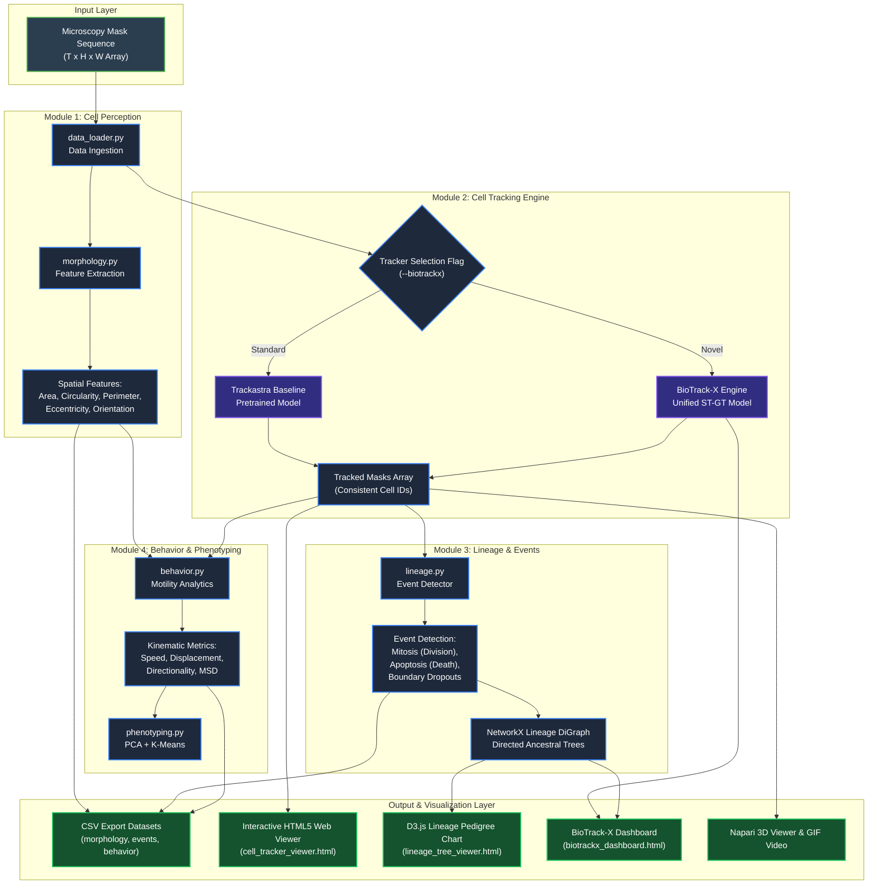
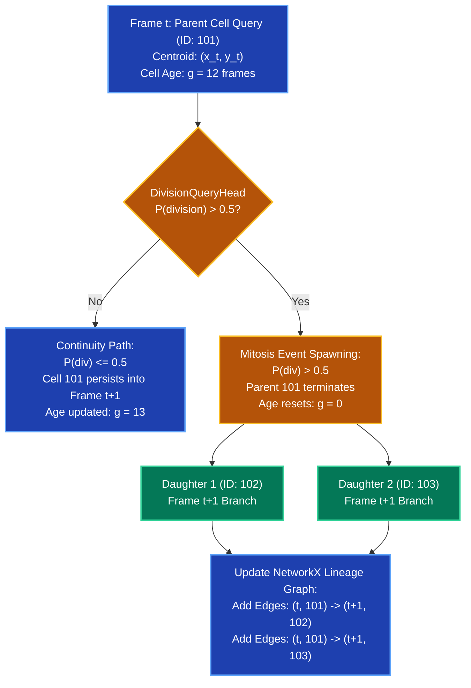

# BioTrack-X & Cell Track: Architecture Diagrams & Flowcharts

This document contains the official architecture diagrams and flowcharts for the **Cell Track** biological analysis pipeline and the **BioTrack-X** Spatio-Temporal Graph Transformer deep learning model.

---

## 1. End-to-End System & Data Pipeline Flowchart

---

## 2. BioTrack-X Neural Model Architecture Flowchart

```mermaid
flowchart LR
    classDef encStyle fill:#1e3a8a,stroke:#3b82f6,stroke-width:2px,color:#fff;
    classDef tfStyle fill:#581c87,stroke:#a855f7,stroke-width:2px,color:#fff;
    classDef bioStyle fill:#701a75,stroke:#ec4899,stroke-width:2px,color:#fff;
    classDef lossStyle fill:#064e3b,stroke:#10b981,stroke-width:2px,color:#fff;

    subgraph INPUT ["Input Frame Sequence"]
        IN1["Cell Label Masks<br/>T frames, H x W"]
    end

    subgraph MOD1 ["1. Spatial Encoder (encoder.py)"]
        E1["ResNet-18 Backbone<br/>Feature Map F_t (128-dim)"]:::encStyle
        E2["4-Shift TTA Engine<br/>Test-Time Augmentation"]:::encStyle
        E3["Centroid (μ_t) & Aleatoric<br/>Uncertainty (σ_t^2)"]:::encStyle
    end

    subgraph MOD2 ["2. Spatio-Temporal Transformer (transformer.py)"]
        T1["Query Initialization<br/>N_max Active Cell Queries"]:::tfStyle
        T2["Spatio-Temporal Attention<br/>Multi-Head Self/Cross Attention"]:::tfStyle
        T3["DivisionQueryHead<br/>Edge-Centric Mitosis Branch"]:::tfStyle
        T4["Predictions:<br/>Track Centroids + Mitosis Flags"]:::tfStyle
    end

    subgraph MOD3 ["3. Biological Prior (erlang_prior.py)"]
        B1["Cell Lifetime Tracker<br/>Cell Age (g_i) in frames"]:::bioStyle
        B2["Erlang(alpha=2, beta)<br/>Probability Density Prior"]:::bioStyle
        B3["Differentiable Bio Cost<br/>Penalizes Early/Late Divisions"]:::bioStyle
    end

    subgraph MOD4 ["4. Multi-Task Loss (loss.py)"]
        L1["L_track: Centroid Hungarian Loss"]:::lossStyle
        L2["L_seg: Dice + BCE Mask Loss"]:::lossStyle
        L3["L_div: Mitosis Binary Cross-Entropy"]:::lossStyle
        L4["L_bio: Erlang Lifetime Cost"]:::lossStyle
        LTOT["L_total = λ1 L_track + λ2 L_seg<br/>+ λ3 L_div + λ4 L_bio"]:::lossStyle
    end

    %% Connections
    IN1 --> E1
    IN1 --> E2
    E1 --> E3
    E2 --> E3
    E1 & E3 --> T1
    T1 --> T2
    T2 --> T3
    T3 --> T4
    T4 --> B1
    B1 --> B2
    B2 --> B3
    T4 --> L1 & L2 & L3
    B3 --> L4
    L1 & L2 & L3 & L4 --> LTOT
```

---

## 3. Cell Lineage Reconstruction & Mitosis Spawning Flowchart

---

## 4. System Components & Module Directory Mapping

| Layer / Module | Primary File / Path | Core Algorithm / Function | Output Artifact |
| :--- | :--- | :--- | :--- |
| **Pipeline CLI** | [`main.py`](file:///c:/Users/visha/Desktop/Computer%20Vision/Cell_Track/main.py) | Main orchestrator & argparse CLI | Complete execution pipeline |
| **Data Loader** | [`data_loader.py`](file:///c:/Users/visha/Desktop/Computer%20Vision/Cell_Track/data_loader.py) | Loads 2D/3D microscopy label arrays | `masks` NumPy array |
| **Morphology Engine** | [`morphology.py`](file:///c:/Users/visha/Desktop/Computer%20Vision/Cell_Track/morphology.py) | Area, Circularity, Perimeter, Orientation | `cell_morphology.csv` |
| **Baseline Tracker** | [`tracker.py`](file:///c:/Users/visha/Desktop/Computer%20Vision/Cell_Track/tracker.py) | Trackastra graph transformer linking | `tracked_masks`, `track_graph` |
| **BioTrack-X Model** | [`biotrack_x/model.py`](file:///c:/Users/visha/Desktop/Computer%20Vision/Cell_Track/biotrack_x/model.py) | Unified ST-GT + TTA + Erlang Prior | BioTrack-X tracked graph & masks |
| **Lineage Events** | [`lineage.py`](file:///c:/Users/visha/Desktop/Computer%20Vision/Cell_Track/lineage.py) | Mitosis/Apoptosis detection & DAG trees | `cell_events.csv`, DiGraph |
| **Motility Kinematics**| [`behavior.py`](file:///c:/Users/visha/Desktop/Computer%20Vision/Cell_Track/behavior.py) | Speed, displacement, directionality, MSD | `cell_behavior.csv` |
| **Phenotyping** | [`phenotyping.py`](file:///c:/Users/visha/Desktop/Computer%20Vision/Cell_Track/phenotyping.py) | PCA dimensionality reduction & K-Means | `phenotyping_results/` |
| **Web Visualizers** | [`generate_web_visualizer.py`](file:///c:/Users/visha/Desktop/Computer%20Vision/Cell_Track/generate_web_visualizer.py) [`generate_lineage_visualizer.py`](file:///c:/Users/visha/Desktop/Computer%20Vision/Cell_Track/generate_lineage_visualizer.py) [`generate_biotrackx_dashboard.py`](file:///c:/Users/visha/Desktop/Computer%20Vision/Cell_Track/generate_biotrackx_dashboard.py) | HTML5 Canvas & D3.js Generators | `cell_tracker_viewer.html` `lineage_tree_viewer.html` `biotrackx_dashboard.html` |
